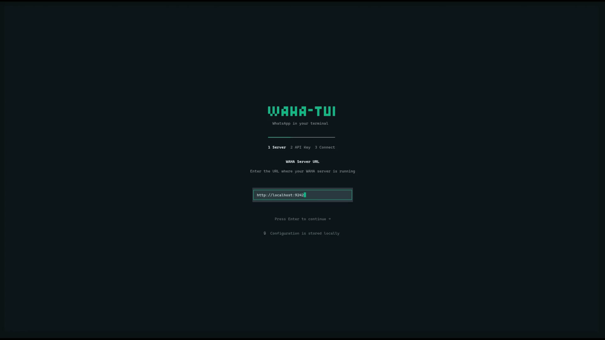
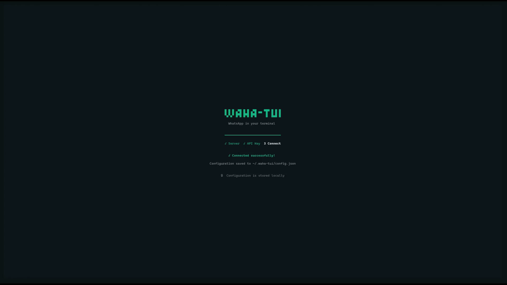
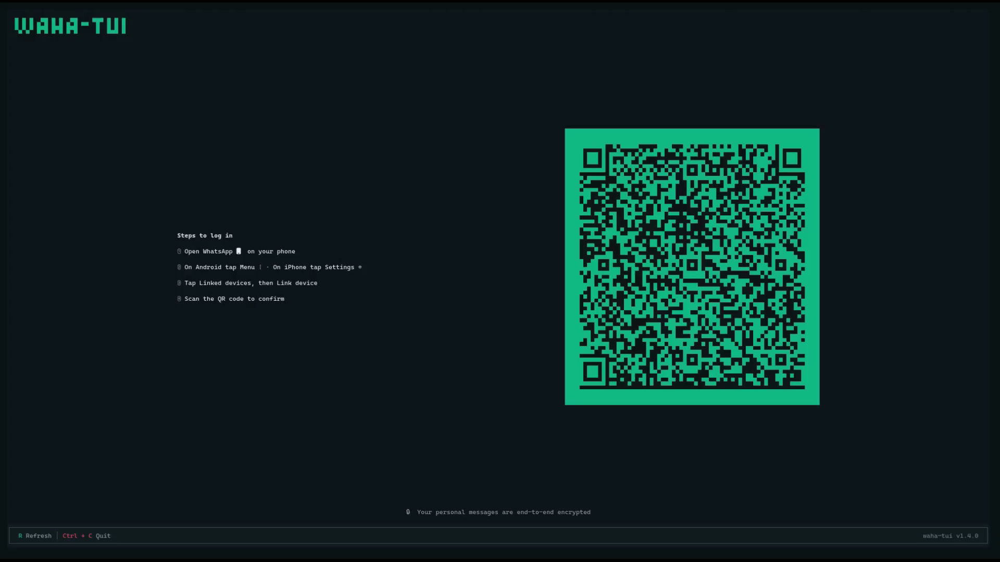
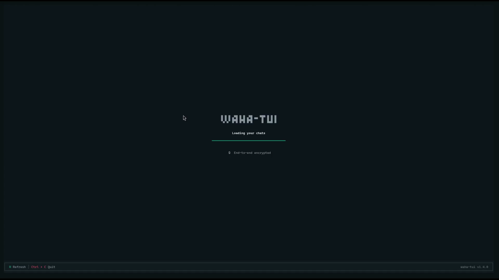
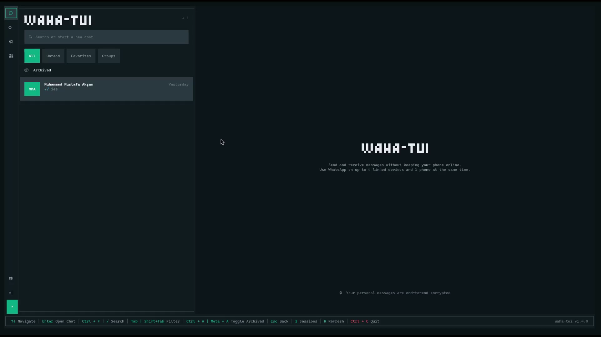
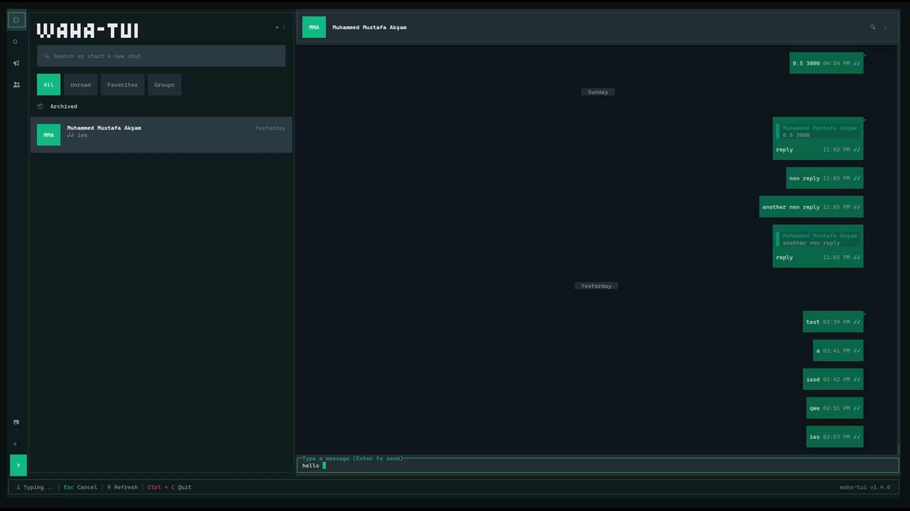

# WAHA TUI

> **WhatsApp in your terminal.**

[](https://www.npmjs.com/package/@muhammedaksam/waha-tui)
[](https://opensource.org/licenses/MIT)
[](https://www.typescriptlang.org/)
[](https://bun.sh/)
[](https://github.com/muhammedaksam/waha-tui/actions)

> ⚠️ **Work In Progress** - This project is in early experimental development. Features may be incomplete, unstable, or change without notice.

A beautiful Terminal User Interface for WhatsApp using [WAHA (WhatsApp HTTP API)](https://github.com/devlikeapro/waha). Manage your WhatsApp sessions, chats, and messages directly from your terminal with an intuitive TUI powered by [OpenTUI](https://opentui.com).

<p align="center">
  <video src="https://github.com/user-attachments/assets/151a3ce4-fbf2-477a-83e7-3bc77e59a980" width="90%" autoplay loop muted></video>
</p>

## Features

- 📱 **Session Management** - Create, view, and manage WAHA sessions with QR code or phone number pairing
- 💬 **Chat Interface** - Browse chats with WhatsApp-style layout and real-time updates
- ✉️ **Messaging** - Send and receive messages with read receipts
- 🎨 **Beautiful UI** - WhatsApp Web-inspired interface with colors and icons
- ⚡ **Fast & Lightweight** - Built with Bun for blazing-fast performance
- 🔒 **Secure** - All configuration stored locally in `$XDG_CONFIG_HOME/waha-tui/`
- 🔄 **Auto-Refresh** - QR codes refresh automatically, status updates in real-time

## Screenshots

<p align="center">
  
  
</p>
<p align="center">
  
  
</p>
<p align="center">
  
  
</p>

## Quick Start

### Run directly with bunx (no installation required)

```bash
bunx @muhammedaksam/waha-tui
```

### Or install globally

```bash
bun add -g @muhammedaksam/waha-tui
waha-tui
```

### Or clone and run locally

```bash
git clone https://github.com/muhammedaksam/waha-tui.git
cd waha-tui
bun install
bun dev
```

## Prerequisites

- [Bun](https://bun.sh) >= 1.0
- A running [WAHA server](https://github.com/devlikeapro/waha)

### WEBJS Engine Configuration

If you're using the **WEBJS** engine (default for WAHA CORE), you must enable `tagsEventsOn` in your session config to receive typing indicators (`presence.update`) and message ack events:

```json
{
  "name": "default",
  "config": {
    "webjs": {
      "tagsEventsOn": true
    }
  }
}
```

> **Note**: This setting is required for real-time typing indicators to work. See [WAHA documentation](https://waha.devlike.pro/docs/how-to/sessions/#webjs) for more details.

## Configuration

On first run, WAHA TUI will prompt you for configuration with a beautiful setup wizard.

Configuration is stored in `$XDG_CONFIG_HOME/waha-tui/` (defaults to `~/.config/waha-tui/`) with secrets separated from metadata:

### $XDG_CONFIG_HOME/waha-tui/.env (Secrets)

```env
# WAHA TUI Configuration
# Connection settings for WAHA server

WAHA_URL=http://localhost:3000
WAHA_API_KEY=your-api-key-here
```

### $XDG_CONFIG_HOME/waha-tui/config.json (Metadata)

```json
{
  "version": "1.0.0",
  "createdAt": "2024-12-19T00:00:00.000Z",
  "updatedAt": "2024-12-19T00:00:00.000Z"
}
```

### Development: Project .env

For development, you can also create a `.env` in the project root which takes precedence:

```env
WAHA_URL=http://localhost:3000
WAHA_API_KEY=your-api-key-here
```

## Usage

### Keyboard Shortcuts

| Key      | Action                                        |
| -------- | --------------------------------------------- |
| `↑/↓`    | Navigate lists                                |
| `Enter`  | Select item / Open chat / Submit phone number |
| `Esc`    | Go back / Cancel phone pairing                |
| `i`      | Enter input mode (in conversation)            |
| `r`      | Refresh current view                          |
| `n`      | Create new session (in Sessions view)         |
| `p`      | Switch to phone pairing mode (in QR view)     |
| `1`      | Go to Sessions view                           |
| `2`      | Go to Chats view                              |
| `q`      | Quit / Go back / Switch to QR mode            |
| `Ctrl+C` | Exit immediately                              |

### Debug Logging

Enable debug logging to troubleshoot issues:

```bash
# Via environment variable
WAHA_TUI_DEBUG=1 bun dev

# Via command-line flag
bun dev --debug
```

Debug logs are saved to `$XDG_CONFIG_HOME/waha-tui/debug.log` with automatic sanitization of sensitive data.

## Development

```bash
# Install dependencies
bun install

# Run in development mode (with watch)
bun run dev

# Type check
bun run typecheck

# Lint
bun run lint

# Format
bun run format

# Run all checks (typecheck + lint + format:check)
bun run check

# Fix all issues (lint:fix + format)
bun run fix

# Build for production
bun run build
```

### Project Structure

```bash
waha-tui/
├── src/
│   ├── client/                     # WAHA API client (domain-split modules)
│   │   ├── core.ts                 # Client initialization & utilities
│   │   ├── chatActions.ts          # Chat operations (archive, delete, etc.)
│   │   ├── messageActions.ts       # Message operations (send, star, react)
│   │   ├── sessionActions.ts       # Session & contact management
│   │   ├── presenceActions.ts      # Presence & activity management
│   │   └── index.ts                # Barrel exports
│   ├── components/                 # Reusable UI components
│   ├── config/                     # Configuration management
│   ├── handlers/                   # Action handlers
│   │   ├── ContextMenuActions.ts   # Context menu action execution
│   │   └── index.ts
│   ├── services/                   # Background services (WebSocket)
│   ├── state/                      # Global state management
│   ├── utils/                      # Utility functions
│   ├── views/                      # Main application views
│   │   ├── conversation/           # Conversation view modules
│   │   │   ├── MessageHelpers.ts   # Sender colors, date formatting
│   │   │   ├── MessageRenderer.ts  # Message bubble rendering
│   │   │   ├── ReplyContext.ts     # Reply/quote rendering
│   │   │   └── index.ts
│   │   └── ...
│   └── index.ts                    # Main entry point
├── .github/
│   ├── workflows/                  # CI/CD workflows
│   └── actions/                    # Reusable actions
└── package.json
```

## Technologies

- **Runtime**: [Bun](https://bun.sh)
- **UI Framework**: [OpenTUI](https://opentui.com)
- **WAHA SDK**: [@muhammedaksam/waha-node](https://www.npmjs.com/package/@muhammedaksam/waha-node)
- **TypeScript**: Type-safe development

## Contributing

Contributions are welcome! Please feel free to submit a Pull Request.

1. Fork the repository
2. Create your feature branch (`git checkout -b feature/amazing-feature`)
3. Commit your changes (`git commit -m 'Add some amazing feature'`)
4. Push to the branch (`git push origin feature/amazing-feature`)
5. Open a Pull Request

## Security

See [SECURITY.md](SECURITY.md) for security policy and reporting vulnerabilities.

## License

This project is licensed under the MIT License - see the [LICENSE](LICENSE) file for details.

## Related Projects

- [WAHA HTTP API](https://github.com/devlikeapro/waha) - WhatsApp HTTP API
- [WAHA Node SDK](https://github.com/muhammedaksam/waha-node) - TypeScript SDK for WAHA
- [OpenTUI](https://opentui.com) - Terminal UI framework used by waha-tui
