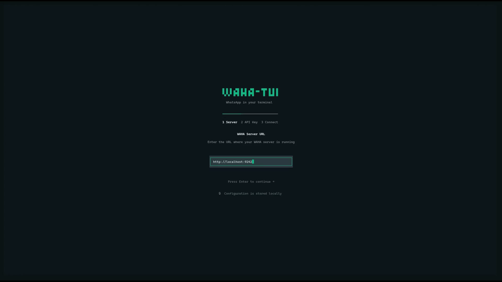
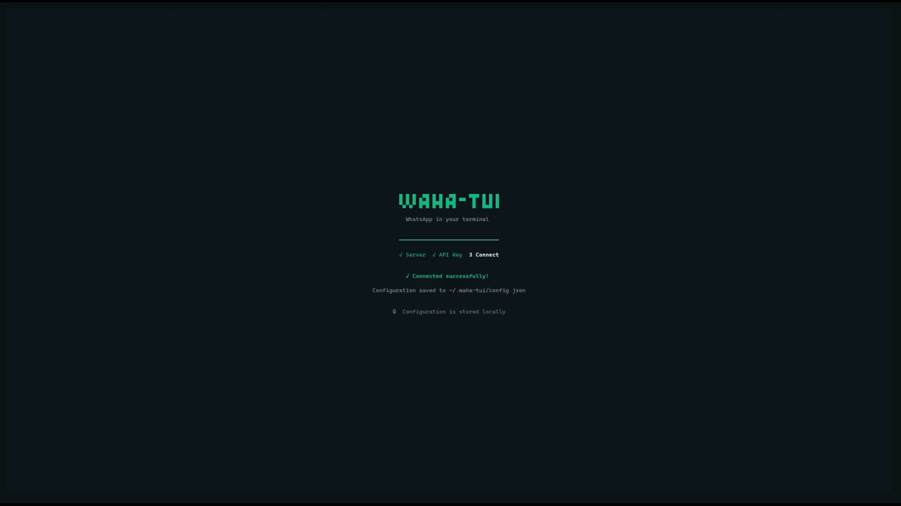
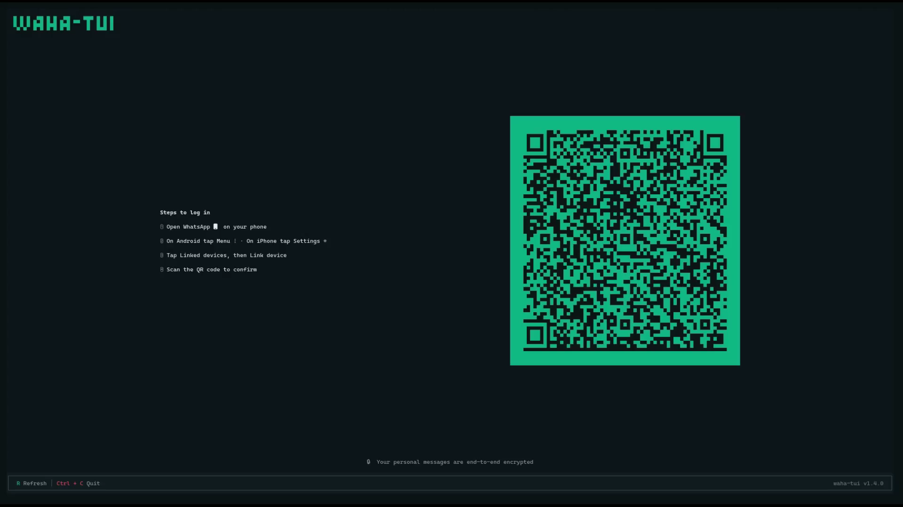
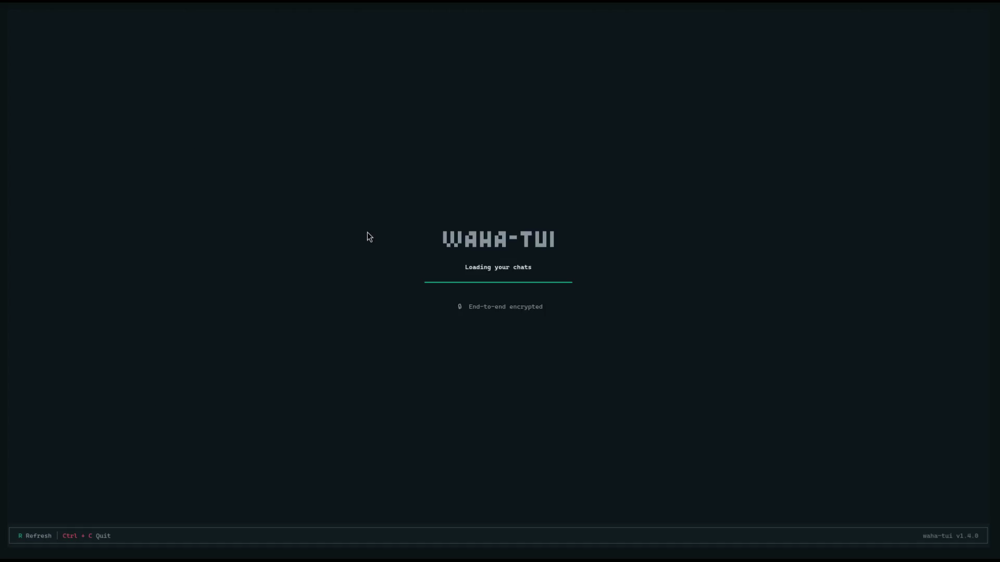
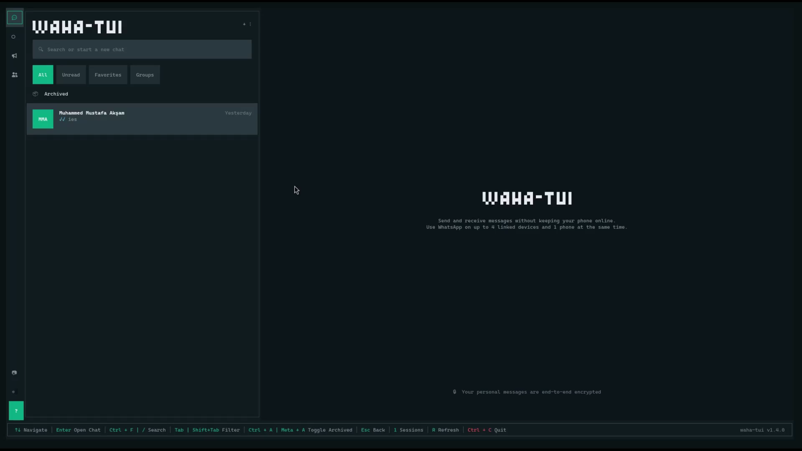
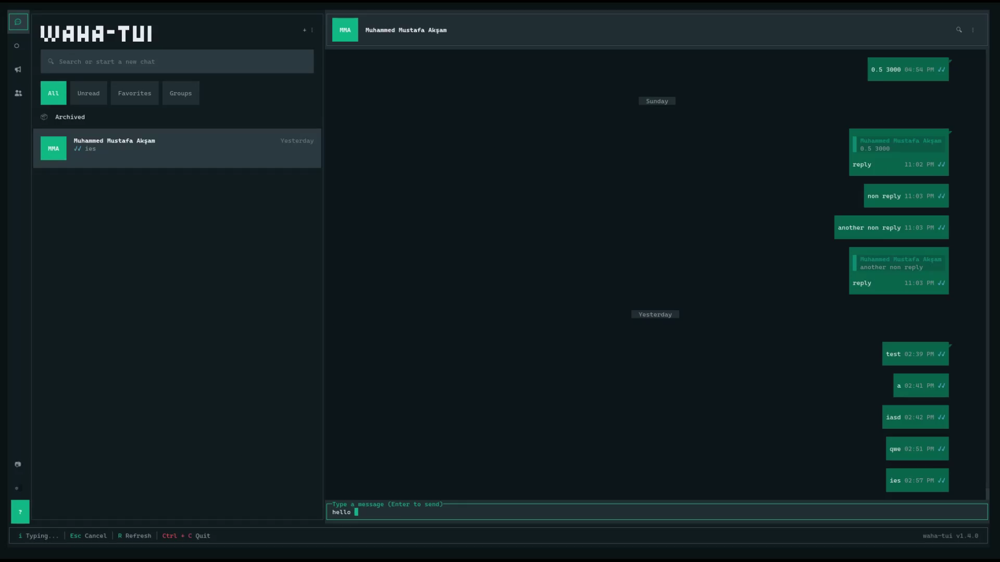

# WAHA TUI

> **WhatsApp in your terminal.**

[](https://www.npmjs.com/package/@muhammedaksam/waha-tui)
[](https://opensource.org/licenses/MIT)
[](https://www.typescriptlang.org/)
[](https://bun.sh/)
[](https://github.com/muhammedaksam/waha-tui/actions)

> ⚠️ **Beta** - This project is under active development. Some features may be incomplete or change between releases.

A beautiful Terminal User Interface for WhatsApp using [WAHA (WhatsApp HTTP API)](https://github.com/devlikeapro/waha). Manage your WhatsApp sessions, chats, and messages directly from your terminal with an intuitive TUI powered by [OpenTUI](https://opentui.com).

<p align="center">
  <video src="https://github.com/user-attachments/assets/151a3ce4-fbf2-477a-83e7-3bc77e59a980" width="90%" autoplay loop muted></video>
</p>

## Features

- 📱 **Session Management** - Create, view, and manage WAHA sessions with QR code or phone number pairing
- 💬 **Chat Interface** - Browse chats with WhatsApp-style layout and real-time updates
- ✉️ **Messaging** - Send and receive messages with read receipts
- 🔍 **Search & Filters** - Filter chats by all, unread, favorites, or groups with instant search
- 📋 **Context Menus** - Right-click style menus for chats (archive, delete, mark unread) and messages (star, pin, react, forward, delete)
- ⚙️ **Settings** - Configurable notification preferences (messages, groups, status), enter-to-send, and background sync
- 🔔 **Desktop Notifications** - Native OS notifications for incoming messages with per-category controls
- 🔄 **Real-Time Updates** - WebSocket-powered live updates, auto-refreshing QR codes, and typing indicators
- 🔢 **Unread Badges** - Visual unread message counts on the chat list
- 🎨 **Beautiful UI** - WhatsApp Web-inspired interface with colors and icons
- ⚡ **Fast & Lightweight** - Built with Bun for blazing-fast performance
- 🔒 **Secure** - All configuration stored locally in `$XDG_CONFIG_HOME/waha-tui/`
- 🆕 **Update Checker** - Automatic notification when a new version is available

## Screenshots

<p align="center">
  
  
</p>
<p align="center">
  
  
</p>
<p align="center">
  
  
</p>

## Quick Start

### Run directly with bunx (no installation required)

```bash
bunx @muhammedaksam/waha-tui
```

### Or install globally

```bash
bun add -g @muhammedaksam/waha-tui
waha-tui
```

### Or clone and run locally

```bash
git clone https://github.com/muhammedaksam/waha-tui.git
cd waha-tui
bun install
bun dev
```

## Prerequisites

- [Bun](https://bun.sh) >= 1.0
- A running [WAHA server](https://github.com/devlikeapro/waha)

### WEBJS Engine Configuration

If you're using the **WEBJS** engine (default for WAHA CORE), you must enable `tagsEventsOn` in your session config to receive typing indicators (`presence.update`) and message ack events:

```json
{
  "name": "default",
  "config": {
    "webjs": {
      "tagsEventsOn": true
    }
  }
}
```

> **Note**: This setting is required for real-time typing indicators to work. See [WAHA documentation](https://waha.devlike.pro/docs/how-to/sessions/#webjs) for more details.

## Configuration

On first run, WAHA TUI will prompt you for configuration with a beautiful setup wizard.

Configuration is stored in `$XDG_CONFIG_HOME/waha-tui/` (defaults to `~/.config/waha-tui/`) with secrets separated from metadata:

### $XDG_CONFIG_HOME/waha-tui/.env (Secrets)

```env
# WAHA TUI Configuration
# Connection settings for WAHA server

WAHA_URL=http://localhost:3000
WAHA_API_KEY=your-api-key-here
```

### $XDG_CONFIG_HOME/waha-tui/config.json (Metadata & Settings)

```json
{
  "version": "1.5.17",
  "createdAt": "2024-12-19T00:00:00.000Z",
  "updatedAt": "2024-12-19T00:00:00.000Z",
  "settings": {
    "enterIsSend": true,
    "messageNotifications": {
      "showNotifications": true,
      "showReactionNotifications": false,
      "playSound": true
    },
    "groupNotifications": {
      "showNotifications": true,
      "showReactionNotifications": false,
      "playSound": true
    },
    "statusNotifications": {
      "showNotifications": false,
      "showReactionNotifications": false,
      "playSound": false
    },
    "showPreviews": true,
    "backgroundSync": true
  }
}
```

### Development: Project .env

For development, you can also create a `.env` in the project root which takes precedence:

```env
WAHA_URL=http://localhost:3000
WAHA_API_KEY=your-api-key-here
```

## Usage

### Keyboard Shortcuts

#### Global

| Key      | Action              |
| -------- | ------------------- |
| `1`      | Go to Sessions view |
| `2`      | Go to Chats view    |
| `Ctrl+C` | Exit immediately    |

#### QR / Phone Pairing

| Key         | Action                       |
| ----------- | ---------------------------- |
| `p`         | Switch to phone pairing mode |
| `q`         | Switch to QR mode / Go back  |
| `0-9`       | Enter phone number digits    |
| `Backspace` | Delete last digit            |
| `Enter`     | Submit phone number          |
| `Esc`       | Cancel phone pairing         |

#### Sessions

| Key        | Action                           |
| ---------- | -------------------------------- |
| `↑/↓`      | Navigate session list            |
| `Enter`    | Select session                   |
| `Home/End` | Jump to first / last session     |
| `n`        | Create new session               |
| `r`        | Refresh sessions                 |
| `q`        | Logout & delete selected session |

> ⚠️ The `q` key in Sessions view performs a **destructive** action: it logs out and deletes the current session.

#### Chats

| Key              | Action                                      |
| ---------------- | ------------------------------------------- |
| `↑/↓`            | Navigate chat list                          |
| `Enter`          | Open selected chat                          |
| `Home/End`       | Jump to first / last chat                   |
| `PageUp/Left`    | Page up (12 items)                          |
| `PageDown/Right` | Page down (12 items)                        |
| `Tab/Shift+Tab`  | Cycle filters (all/unread/favorites/groups) |
| `/` or `Ctrl+F`  | Focus search input                          |
| `c`              | Open chat context menu                      |
| `s`              | Open settings                               |
| `r`              | Refresh chats                               |
| `Ctrl+A`         | Toggle archived chats view                  |
| `Esc`            | Clear search / Exit archived / Go back      |

#### Conversation

| Key              | Action                    |
| ---------------- | ------------------------- |
| `i`              | Enter message input mode  |
| `↑/↓`            | Scroll messages           |
| `PageUp/Left`    | Scroll up (large jump)    |
| `PageDown/Right` | Scroll down (large jump)  |
| `m`              | Open message context menu |
| `Esc`            | Exit input mode / Go back |

#### Settings

| Key            | Action                         |
| -------------- | ------------------------------ |
| `↑/↓` or `j/k` | Navigate menu items            |
| `Enter/Space`  | Toggle setting / Open sub-menu |
| `Esc`          | Go back                        |

### Debug Logging

Enable debug logging to troubleshoot issues:

```bash
# Via environment variable
WAHA_TUI_DEBUG=1 bun dev

# Via command-line flag
bun dev --debug
```

Debug logs are saved to `$XDG_CONFIG_HOME/waha-tui/debug.log` with automatic sanitization of sensitive data.

## Development

See [DEVELOPMENT.md](DEVELOPMENT.md) for development setup, commands, and project structure.

## Technologies

- **Runtime**: [Bun](https://bun.sh)
- **UI Framework**: [OpenTUI](https://opentui.com)
- **WAHA SDK**: [@muhammedaksam/waha-node](https://www.npmjs.com/package/@muhammedaksam/waha-node)
- **TypeScript**: Type-safe development

## Contributing

See [CONTRIBUTING.md](CONTRIBUTING.md) for development setup and guidelines.

## Security

See [SECURITY.md](SECURITY.md) for security policy and reporting vulnerabilities.

## License

This project is licensed under the MIT License - see the [LICENSE](LICENSE) file for details.

## Related Projects

- [WAHA HTTP API](https://github.com/devlikeapro/waha) - WhatsApp HTTP API
- [WAHA Node SDK](https://github.com/muhammedaksam/waha-node) - TypeScript SDK for WAHA
- [OpenTUI](https://opentui.com) - Terminal UI framework used by waha-tui
